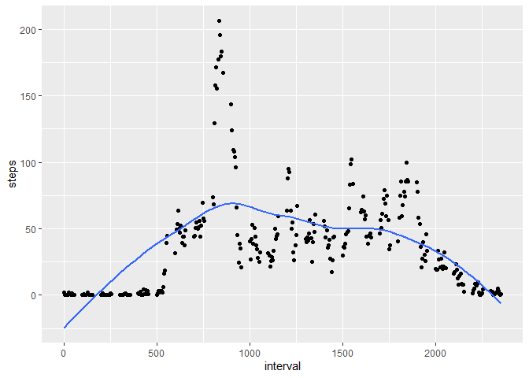
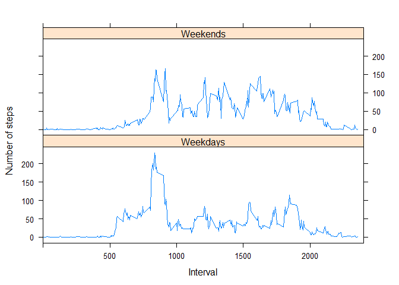

## Loading and preprocessing the data


### Download data from the internet (the link was copied by the Coursera database hyperlink) and read the data


```r
if (!file.exists("activity.csv") )
    {
     dlurl <- 'http://d396qusza40orc.cloudfront.net/repdata%2Fdata%2Factivity.zip'  
     download.file(dlurl,destfile='repdata%2Fdata%2Factivity.zip',mode='wb')  
     unzip('repdata%2Fdata%2Factivity.zip')
    }


dataset <- read.csv("activity.csv") 
```

## What is mean total number of steps taken per day?

### Total number of steps per day


```r
dailysteps <- aggregate(steps ~ date, dataset, sum)
```

### Histogram


```r
hist(dailysteps$steps, main = paste("Average Total Daily Steps"), col="blue",xlab="Average Daily Steps")
```

<!-- -->

### The daily mean

```r
daily_mean <- mean(dailysteps$steps)
daily_mean
```

```
## [1] 10766.19
```
### The daily median

```r
daily_median <- median(dailysteps$steps)
daily_median
```

```
## [1] 10765
```
## What is the average daily activity pattern?

### Processing data

```r
intervalsteps <- aggregate(steps ~ interval, dataset, mean)
```


### Make a time series plot - Average Number of Steps per Day by interval

```r
library(ggplot2)
ggplot(intervalsteps, aes(interval, steps)) +
geom_point() +
geom_smooth(methog = "loess", se = FALSE)
```

```
## Warning: Ignoring unknown parameters: methog
```

```
## `geom_smooth()` using method = 'loess' and formula 'y ~ x'
```

<!-- -->


### Which 5-minute interval, on average across all the days in the dataset, contains the maximum number of steps?

```r
max_steps <- intervalsteps[which.max(intervalsteps$steps),1]
max_steps
```

```
## [1] 835
```

## Imputing missing values

### Calculate and report the total number of missing values in the dataset

```r
Missing <- sum(!complete.cases(dataset))
Missing
```

```
## [1] 2304
```
### Devise a strategy for filling in all of the missing values in the dataset

```r
meansteps <- aggregate(steps ~ interval, data = dataset, FUN = mean)
fillingstrategy <- numeric()
for (i in 1:nrow(dataset)) {

    a <- dataset[i, ]
    if (is.na(a$steps)) {
    
        steps <- subset(meansteps, interval == a$interval)$steps
        
    } 
    else {
    
        steps <- a$steps
    }
    fillingstrategy <- c(fillingstrategy, steps)
}
```
### Create a new dataset that is equal to the original dataset but with the missing data filled in

```r
filleddataset <- dataset
filleddataset$steps <- fillingstrategy
```
### Make a histogram of the total number of steps taken each day and Calculate and report the mean and median total number of steps taken per day.

```r
showdifference <- aggregate(steps ~ date, data = filleddataset, sum, na.rm = TRUE)
hist(showdifference$steps, main = paste("Daily Steps"), col="pink", xlab="Daily Steps")
hist(dailysteps$steps, main = paste("Daily Steps"), col="red", xlab="Daily Steps", add=T)
legend("topright", c("After", "Before"), col=c("pink", "red"), lwd=8)
```

<!-- -->


### Mean

```r
aftermean <- mean(showdifference$steps)
aftermean
```

```
## [1] 10766.19
```

### Median

```r
aftermedian <- median(showdifference$steps)
aftermedian
```

```
## [1] 10766.19
```

### Do these values differ from the estimates from the first part of the assignment? What is the impact of imputing missing data on the estimates of the total daily number of steps?

#### Yes, by comparing, it different at Mean; The impact was mostly on 10000<Steps<15000 as shown on the Histogram.


## Are there differences in activity patterns between weekdays and weekends?

###Create a new factor variable in the dataset with two levels – “weekday” and “weekend” indicating whether a given date is a weekday or weekend day.


```r
weekdays <- c("Monday", "Tuesday", "Wednesday", "Thursday", "Friday")
filleddataset$dow = as.factor(ifelse(is.element(weekdays(as.Date(filleddataset$date)),weekdays), "Weekdays", "Weekends"))

h <- aggregate(steps ~ interval + dow, data = filleddataset, mean, na.rm = TRUE)


library(lattice)

xyplot(steps ~ interval | h$dow, data = h,
       type="l",
       xlim=c(0,2400),
       layout=c(1,2),
       xlab="Interval",
       ylab="Number of steps")
```

<!-- -->

